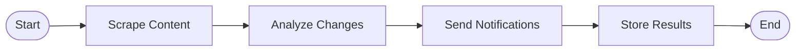

# Design Document

## Overview

The intelligent monitoring system is a well-architected application that successfully implements most of the stated requirements using modern Python technologies. The system demonstrates good separation of concerns with distinct agents for different responsibilities, proper use of LangGraph for workflow orchestration, and robust background processing with Celery.

## Architecture

### High-Level Architecture


### Agent Workflow (LangGraph)



## Components and Interfaces

### Core Agents

**Coordinator Agent**
- Orchestrates the complete monitoring workflow using LangGraph
- Manages state transitions between agents
- Handles error propagation and recovery
- Stores content snapshots for future comparisons

**Scheduler Agent**
- Identifies targets due for monitoring based on frequency settings
- Updates last-checked timestamps
- Handles timezone-aware scheduling logic

**Scraper Agent**
- Fetches content from target URLs with appropriate headers
- Implements target-type-specific content extraction
- Handles network errors and timeouts gracefully
- Extracts meaningful content (profiles, posts, main content)

**Analyzer Agent**
- Uses Gemini 2.0-flash-exp for intelligent change detection
- Filters out minor formatting and timestamp changes
- Generates concise summaries of meaningful changes
- Falls back to simple text comparison if AI fails

**Notifier Agent**
- Sends console notifications for all detected changes
- Sends email notifications when SMTP is configured
- Formats notifications with timestamps and summaries

### Data Models

**MonitoringTarget**
- URL, target type, frequency, user association
- Creation and last-checked timestamps
- Active/inactive status and optional naming

**ChangeDetection**
- Target identification and change metadata
- Before/after content snapshots
- AI-generated change summaries with timestamps

**MonitoringState**
- Workflow state management for LangGraph
- Current and previous content storage
- Error handling and change accumulation

### API Endpoints

- `POST /targets` - Add new monitoring targets
- `GET /targets` - List user's monitoring targets
- `DELETE /targets/{url}` - Remove monitoring targets
- `PUT /targets/{url}` - Update target configuration
- `GET /changes` - Retrieve change history
- `GET /health` - System health verification

## Data Models

### MongoDB Collections

**targets Collection**
```json
{
  "_id": "ObjectId",
  "url": "string",
  "target_type": "linkedin_profile|linkedin_company|website",
  "frequency_minutes": "number",
  "user_id": "string",
  "name": "string (optional)",
  "created_at": "datetime",
  "last_checked": "datetime",
  "last_content": "string",
  "active": "boolean"
}
```

**changes Collection**
```json
{
  "_id": "ObjectId",
  "target_id": "string",
  "target_url": "string",
  "change_type": "string",
  "summary": "string",
  "before_content": "string",
  "after_content": "string",
  "detected_at": "datetime"
}
```

## Error Handling

### Network and Scraping Errors
- Graceful handling of HTTP errors, timeouts, and connection failures
- Retry logic with exponential backoff for transient failures
- Error state propagation through LangGraph workflow
- Continued monitoring of other targets when individual targets fail

### AI Analysis Failures
- Fallback to simple text comparison when Gemini API fails
- Error logging without stopping the monitoring process
- Graceful degradation of change detection quality

### Database Connection Issues
- Automatic reconnection logic for MongoDB
- Connection pooling and health checks
- Graceful handling of temporary database unavailability

## Testing Strategy

### Current Testing Implementation
- **test_monitoring.py**: Comprehensive integration testing of the monitoring workflow
- **test_celery.py**: Verification of Celery and Redis connectivity
- Manual testing through web interface and API endpoints

### Testing Coverage Analysis
- ✅ Integration testing of complete monitoring cycles
- ✅ Celery task queue and Redis connectivity testing
- ✅ Database connection and basic CRUD operations
- ❌ Unit testing of individual agent components
- ❌ Mock testing of external dependencies (Gemini API, target websites)
- ❌ Error scenario testing (network failures, malformed responses)
- ❌ Performance testing under load

## Current Implementation Strengths

1. **Excellent Architecture**: Clean separation of concerns with well-defined agent responsibilities
2. **Proper Workflow Orchestration**: Effective use of LangGraph for state management
3. **Robust Background Processing**: Celery + Redis implementation with proper task scheduling
4. **AI-Powered Intelligence**: Gemini integration for meaningful change detection
5. **User-Friendly Interface**: Clean web UI for target management
6. **Comprehensive Error Handling**: Graceful degradation and error propagation
7. **Flexible Configuration**: Support for different target types and monitoring frequencies

## Identified Areas for Improvement

### Code Quality and Maintainability
1. **Missing Unit Tests**: No unit tests for individual agent components
2. **Limited Error Scenario Coverage**: Need more comprehensive error handling tests
3. **Code Documentation**: Some methods lack detailed docstrings
4. **Configuration Management**: Environment variables could be better organized

### Performance and Scalability
1. **Content Storage Optimization**: Large content snapshots stored in main collections
2. **Concurrent Processing**: Limited parallelization of monitoring tasks
3. **Rate Limiting**: No built-in rate limiting for target websites
4. **Memory Usage**: Content snapshots not optimized for memory efficiency

### Feature Completeness
1. **User Management**: Basic user system without authentication
2. **Notification Channels**: Limited to console and email notifications
3. **Change History Management**: No cleanup of old changes
4. **Target Validation**: Limited validation of target URLs and accessibility

### Operational Concerns
1. **Monitoring and Observability**: Limited metrics and health monitoring
2. **Deployment Configuration**: No containerization or deployment scripts
3. **Backup and Recovery**: No automated backup procedures
4. **Security**: No authentication or authorization mechanisms

## Recommendations

### High Priority Improvements
1. Add comprehensive unit testing for all agent components
2. Implement proper user authentication and authorization
3. Add rate limiting and respect robots.txt for target websites
4. Optimize content storage to separate large snapshots from metadata

### Medium Priority Enhancements
1. Add more notification channels (Slack, Discord, webhooks)
2. Implement change history cleanup and archiving
3. Add performance monitoring and metrics collection
4. Create Docker containerization for easier deployment

### Low Priority Features
1. Add target URL validation and accessibility checking
2. Implement advanced filtering and change categorization
3. Add bulk target management capabilities
4. Create administrative dashboard for system monitoring

The current implementation successfully delivers the core MVP functionality with a solid architectural foundation that can support these future enhancements.