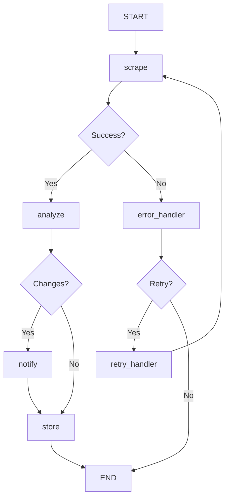

# 🏗️ LangGraph Architecture Documentation

## 📋 Overview

This document provides comprehensive technical documentation for the **LangGraph-native monitoring system**. The system has been completely restructured from a traditional agent-based architecture to leverage LangGraph's advanced capabilities for state management, conditional routing, error handling, and observability.

## 🎯 Architecture Principles

### Core Design Philosophy
- **State-First Design**: All workflow logic centers around proper state management
- **Conditional Intelligence**: Smart routing based on content, errors, and business logic
- **Resilient Operations**: Comprehensive error handling with automatic recovery
- **Observable Workflows**: Complete audit trails and debugging capabilities
- **Scalable Execution**: Designed for high-throughput, parallel processing

### LangGraph Benefits Realized
- ✅ **Type-Safe State Management** with TypedDict validation
- ✅ **Conditional Routing** based on dynamic conditions
- ✅ **Built-in Retry Logic** with exponential backoff
- ✅ **Message History** for debugging and observability
- ✅ **Checkpointing** for workflow persistence and recovery
- ✅ **Error Categorization** with appropriate recovery strategies

## 🔧 Core Components

### 1. Workflow Orchestrator (`workflows/monitoring_workflow.py`)

The central LangGraph workflow that coordinates all monitoring operations.

#### Key Features:
```python
class MonitoringWorkflow:
    def __init__(self):
        self.memory = MemorySaver()  # Built-in state persistence
        self.workflow = self._build_workflow()  # Compiled LangGraph
    
    def _build_workflow(self) -> StateGraph:
        # Creates conditional routing graph with error handling
        workflow = StateGraph(MonitoringWorkflowState)
        
        # Add processing nodes
        workflow.add_node("scrape", scraper_node)
        workflow.add_node("analyze", analyzer_node)
        workflow.add_node("notify", notifier_node)
        workflow.add_node("store", storage_node)
        
        # Add control nodes
        workflow.add_node("error_handler", self._error_handler_node)
        workflow.add_node("retry_handler", self._retry_handler_node)
        
        # Define conditional routing logic
        workflow.add_conditional_edges("scrape", self._route_after_scrape, {...})
        # ... more routing logic
        
        return workflow.compile(checkpointer=self.memory)
```

#### Workflow Execution Flow:


### 2. State Management System

#### MonitoringWorkflowState (TypedDict)
```python
class MonitoringWorkflowState(TypedDict):
    # Target Configuration
    target_url: str                    # URL being monitored
    target_type: str                   # linkedin_profile|linkedin_company|website
    frequency_minutes: int             # Check frequency
    target_name: Optional[str]         # Human-readable name
    
    # Content Tracking
    current_content: Optional[str]     # Latest scraped content
    previous_content: Optional[str]    # Previous content for comparison
    
    # Change Detection Results
    changes_detected: List[Dict[str, Any]]  # Detected changes with metadata
    
    # Workflow Control & Observability
    messages: Annotated[List[BaseMessage], add_messages]  # Conversation history
    step: str                          # Current workflow step
    error: Optional[str]               # Error message if any
    retry_count: int                   # Number of retry attempts
    
    # Metadata & Tracking
    workflow_id: str                   # Unique workflow execution ID
    started_at: str                    # ISO timestamp of start
    last_updated: str                  # ISO timestamp of last update
```

#### State Transitions
Each node receives the current state and returns an updated state:
```python
def scraper_node(state: MonitoringWorkflowState) -> MonitoringWorkflowState:
    # Process current state
    # Update relevant fields
    # Return modified state
    return state
```

### 3. Processing Nodes (`nodes/`)

#### Scraper Node (`nodes/scraper_node.py`)
**Purpose**: Fetch content from target URLs with robust error handling

**Key Features**:
- Multi-strategy content extraction (LinkedIn profiles, companies, websites)
- Comprehensive HTTP error handling (timeouts, rate limits, 404s, etc.)
- User-agent rotation and respectful scraping practices
- Content validation and sanitization

**Error Handling**:
```python
# Categorized error responses
if e.response.status_code == 429:
    error_msg = f"Rate limited by {target_url}"
elif e.response.status_code == 403:
    error_msg = f"Access forbidden to {target_url}"
elif e.response.status_code == 404:
    error_msg = f"Target not found: {target_url}"
```

**Content Extraction Strategies**:
- **LinkedIn Profiles**: Name, headline, experience, recent posts
- **LinkedIn Companies**: Company name, tagline, about section, updates
- **Websites**: Title, meta description, headings, main content

#### Analyzer Node (`nodes/analyzer_node.py`)
**Purpose**: AI-powered change detection and summarization

**Key Features**:
- Google Gemini integration for intelligent change analysis
- Fallback to simple text comparison if AI fails
- Meaningful vs. minor change classification
- Structured change summaries with context

**AI Analysis Pipeline**:
```python
def _detect_meaningful_changes(before: str, after: str, target_type: str) -> str:
    # Use Gemini with context-aware prompts
    system_message = SystemMessage(content=f"""
    You are an expert content analyst for a {target_type} monitoring system.
    
    IGNORE: Minor formatting, timestamps, whitespace
    FOCUS ON: Job changes, announcements, contact info, major updates
    
    If meaningful changes exist, provide concise summary (max 200 words).
    If no meaningful changes, respond with "NO_MEANINGFUL_CHANGES".
    """)
    
    # Process with Gemini and return results
```

**Change Categories Detected**:
- Job title and role changes
- New posts and announcements
- Company updates and news
- Contact information changes
- Product launches and updates
- Personnel and organizational changes

#### Notifier Node (`nodes/notifier_node.py`)
**Purpose**: Multi-channel notification delivery

**Key Features**:
- Console notifications with rich formatting
- Email notifications with HTML templates
- User preference respect (per-user notification settings)
- Multi-user target support (one target, multiple subscribers)

**Notification Channels**:
```python
# Console notification
print("🔔 CHANGE DETECTED")
print(f"Source: {change['target_url']}")
print(f"Summary: {change['summary']}")

# Email notification (if SMTP configured)
msg = MIMEMultipart()
msg['Subject'] = f"Change Detected: {change['target_url']}"
# Send via SMTP
```

#### Storage Node (`nodes/storage_node.py`)
**Purpose**: Data persistence and audit trail creation

**Key Features**:
- Change record persistence in MongoDB
- Target state updates (last_content, last_checked)
- Workflow execution audit trail
- Performance metrics collection

**Storage Operations**:
```python
# Store change records
changes_collection.insert_one(change_record)

# Update target state
targets_collection.update_one(
    {"url": target_url},
    {"$set": {
        "last_content": current_content,
        "last_checked": datetime.now(timezone.utc)
    }}
)

# Create audit record
workflow_collection.insert_one({
    "workflow_id": state["workflow_id"],
    "success": not bool(state.get("error")),
    "changes_count": len(changes_detected),
    # ... more metadata
})
```

### 4. Conditional Routing Logic

#### Route Decision Functions
Each routing function analyzes the current state and determines the next step:

```python
def _route_after_scrape(self, state: MonitoringWorkflowState) -> str:
    """Route after scraping based on success/failure"""
    if state.get("error"):
        if state.get("retry_count", 0) < 3:
            return "retry"  # Attempt retry
        return "error"      # Give up after 3 attempts
    
    if not state.get("current_content"):
        return "error"      # No content scraped
    
    return "analyze"        # Success, proceed to analysis

def _route_after_analyze(self, state: MonitoringWorkflowState) -> str:
    """Route after analysis based on changes detected"""
    if state.get("error"):
        return "error"
    
    changes = state.get("changes_detected", [])
    if changes:
        return "notify"     # Changes found, send notifications
    else:
        return "store"      # No changes, skip notifications
```

#### Routing Decision Matrix
| Current Node | Condition | Next Node | Reason |
|--------------|-----------|-----------|---------|
| scrape | Success + Content | analyze | Normal flow |
| scrape | Error + Retries < 3 | retry_handler | Recoverable error |
| scrape | Error + Retries >= 3 | error_handler | Fatal error |
| analyze | Success + Changes | notify | Changes detected |
| analyze | Success + No Changes | store | Skip notifications |
| analyze | Error | error_handler | Analysis failed |
| notify | Success | store | Complete workflow |
| notify | Error | error_handler | Notification failed |

### 5. Error Handling & Recovery

#### Error Classification System
```python
# Fatal errors (no retry)
fatal_errors = [
    "invalid_url",
    "authentication_failed", 
    "rate_limited_permanently"
]

# Recoverable errors (retry with backoff)
recoverable_errors = [
    "timeout",
    "connection_error",
    "temporary_rate_limit"
]
```

#### Retry Strategy
- **Exponential Backoff**: 2^retry_count seconds (2, 4, 8 seconds)
- **Maximum Retries**: 3 attempts per workflow execution
- **Retry Conditions**: Network errors, timeouts, temporary rate limits
- **No Retry Conditions**: 404 errors, authentication failures, invalid URLs

#### Error Recovery Flow
```python
def _error_handler_node(self, state: MonitoringWorkflowState) -> MonitoringWorkflowState:
    error = state.get("error", "Unknown error")
    retry_count = state.get("retry_count", 0)
    
    # Log error with context
    logger.error(f"Workflow error for {state['target_url']}: {error}")
    
    # Determine if error is fatal
    if any(fatal in error.lower() for fatal in fatal_errors):
        state["fatal_error"] = True
    
    # Add error to message history
    error_message = AIMessage(content=f"Error: {error}. Retry: {retry_count}")
    state["messages"] = state.get("messages", []) + [error_message]
    
    return state
```

## 🔄 Integration Architecture

### Celery Integration
The LangGraph workflow integrates seamlessly with Celery for distributed processing:

```python
@app.task(bind=True, max_retries=3)
def monitor_target_task(self, target_url: str):
    """Celery task using LangGraph workflow"""
    
    # Get target configuration from database
    target_data = get_target_from_db(target_url)
    
    # Run LangGraph workflow (sync version for Celery)
    result = monitoring_workflow.run_monitoring_sync(target_data)
    
    # Schedule next execution
    next_run_time = datetime.now() + timedelta(minutes=target_data["frequency_minutes"])
    monitor_target_task.apply_async(args=[target_url], eta=next_run_time)
    
    return result
```

### API Integration
The FastAPI endpoints trigger LangGraph workflows:

```python
@app.post("/targets")
async def add_target(request: AddTargetRequest, current_user: User = Depends(get_current_active_user)):
    # Create target in database
    target = create_target(request)
    
    # Immediately queue LangGraph workflow
    monitor_target_task.delay(str(target.url))
    
    return {"message": "Target added and monitoring started"}
```

### Database Integration
LangGraph state integrates with MongoDB collections:

- **`targets`**: Target configuration and last known state
- **`changes`**: Detected changes with full context
- **`users`**: User accounts and notification preferences
- **`workflow_executions`**: Complete audit trail of workflow runs

## 📊 Observability & Monitoring

### Workflow Audit Trail
Every workflow execution creates a comprehensive audit record:

```python
workflow_record = {
    "workflow_id": state["workflow_id"],
    "target_url": target_url,
    "target_type": state["target_type"],
    "started_at": state["started_at"],
    "completed_at": datetime.now(timezone.utc).isoformat(),
    "success": not bool(state.get("error")),
    "error": state.get("error"),
    "changes_count": len(changes_detected),
    "retry_count": state.get("retry_count", 0),
    "final_step": state.get("step", "unknown"),
    "execution_time_ms": execution_time,
    "content_length": len(state.get("current_content", "")),
    "ai_analysis_used": bool(state.get("ai_analysis_attempted"))
}
```

### Message History Tracking
LangGraph's built-in message system provides conversation-style logging:

```python
# System initialization
SystemMessage(content="Starting monitoring workflow for linkedin_profile: https://...")

# Step completion
AIMessage(content="Successfully scraped 1,234 characters from target")

# Change detection
AIMessage(content="Meaningful changes detected: Job title updated from 'Senior Developer' to 'Lead Developer'")

# Error handling
AIMessage(content="Error occurred: Rate limited. Retry attempt 1/3")
```

### Performance Metrics
Key metrics tracked per workflow execution:

- **Execution Time**: Total workflow duration
- **Step Timing**: Time spent in each node
- **Content Size**: Bytes of content processed
- **Success Rate**: Percentage of successful executions
- **Retry Statistics**: Frequency and reasons for retries
- **Change Detection Rate**: Percentage of executions finding changes

### Debugging Capabilities

#### Workflow State Inspection
```python
# Get workflow execution history
workflow_collection = db.get_collection("workflow_executions")
executions = workflow_collection.find({"target_url": target_url}).sort("started_at", -1)

# Analyze execution patterns
for execution in executions:
    print(f"Execution {execution['workflow_id']}: {execution['final_step']} in {execution['execution_time_ms']}ms")
```

#### Message History Analysis
```python
# Extract message history from workflow state
messages = final_state.get("messages", [])
for msg in messages:
    print(f"[{msg.__class__.__name__}] {msg.content}")
```

## 🚀 Performance Optimization

### Memory Management
- **State Checkpointing**: LangGraph automatically manages state persistence
- **Message Pruning**: Old message history is cleaned up after workflow completion
- **Content Caching**: Previous content is stored efficiently in MongoDB

### Scalability Patterns
- **Horizontal Scaling**: Multiple Celery workers can process workflows in parallel
- **Workflow Isolation**: Each target runs in its own workflow instance
- **Database Optimization**: Proper indexing for fast target and change lookups

### Resource Optimization
```python
# Efficient content comparison
if current_content == previous_content:
    # Skip expensive AI analysis
    return state

# Limit content size for AI analysis
content_for_ai = current_content[:3000]  # First 3KB only

# Batch database operations
changes_collection.insert_many(all_changes)  # Bulk insert
```

## 🔮 Advanced Features & Future Enhancements

### Planned LangGraph Features

#### 1. Human-in-the-Loop Workflows
```python
# Add approval node for critical changes
workflow.add_node("human_approval", human_approval_node)
workflow.add_conditional_edges(
    "analyze",
    lambda state: "human_approval" if is_critical_change(state) else "notify"
)
```

#### 2. Parallel Target Processing
```python
# Process multiple targets simultaneously
async def monitor_multiple_targets(targets: List[Dict]):
    tasks = [monitoring_workflow.run_monitoring(target) for target in targets]
    results = await asyncio.gather(*tasks)
    return results
```

#### 3. Dynamic Workflow Modification
```python
# Modify workflow based on target type
def build_dynamic_workflow(target_type: str) -> StateGraph:
    workflow = StateGraph(MonitoringWorkflowState)
    
    if target_type == "linkedin_profile":
        workflow.add_node("linkedin_auth", linkedin_auth_node)
    elif target_type == "api_endpoint":
        workflow.add_node("api_auth", api_auth_node)
    
    return workflow
```

#### 4. Streaming Workflow Updates
```python
# Real-time workflow progress updates
async for state_update in workflow.astream(initial_state):
    await websocket.send_json({
        "workflow_id": state_update["workflow_id"],
        "step": state_update["step"],
        "progress": calculate_progress(state_update)
    })
```

### Advanced Routing Strategies

#### Content-Type Specific Routing
```python
def _route_by_content_type(self, state: MonitoringWorkflowState) -> str:
    content = state.get("current_content", "")
    
    if "job posting" in content.lower():
        return "job_analyzer"
    elif "press release" in content.lower():
        return "news_analyzer"
    else:
        return "general_analyzer"
```

#### Priority-Based Processing
```python
def _route_by_priority(self, state: MonitoringWorkflowState) -> str:
    target_url = state["target_url"]
    priority = get_target_priority(target_url)
    
    if priority == "high":
        return "immediate_notify"
    elif priority == "medium":
        return "batch_notify"
    else:
        return "delayed_notify"
```

## 🛠️ Development Guidelines

### Adding New Nodes
1. Create node function with proper signature:
   ```python
   def new_node(state: MonitoringWorkflowState) -> MonitoringWorkflowState:
       # Process state
       # Update relevant fields
       # Add message to history
       return state
   ```

2. Add to workflow graph:
   ```python
   workflow.add_node("new_node", new_node)
   workflow.add_conditional_edges("previous_node", route_function, {"new": "new_node"})
   ```

3. Update routing logic:
   ```python
   def route_to_new_node(state: MonitoringWorkflowState) -> str:
       if some_condition(state):
           return "new_node"
       return "default_node"
   ```

### Testing Workflows
```python
# Unit test individual nodes
def test_scraper_node():
    initial_state = create_test_state()
    result_state = scraper_node(initial_state)
    assert result_state["current_content"] is not None

# Integration test complete workflow
async def test_complete_workflow():
    target_data = {"url": "https://example.com", "target_type": "website"}
    result = await monitoring_workflow.run_monitoring(target_data)
    assert result["success"] is True
```

### Debugging Workflows
```python
# Enable debug logging
import logging
logging.getLogger("workflows.monitoring_workflow").setLevel(logging.DEBUG)

# Add debug checkpoints
def debug_node(state: MonitoringWorkflowState) -> MonitoringWorkflowState:
    logger.debug(f"State at debug checkpoint: {state}")
    return state

workflow.add_node("debug", debug_node)
```

This comprehensive architecture documentation provides the foundation for understanding, maintaining, and extending the LangGraph-based monitoring system. The system leverages LangGraph's full capabilities while maintaining clean separation of concerns and robust error handling.